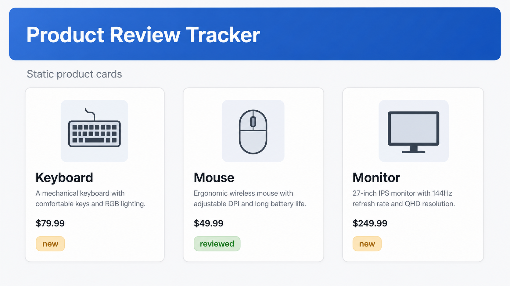

# 01 React Mental Model And JSX

[Back to React Study Plan](../README.md)

## Goal

Understand React as JavaScript functions that return UI.

By the end of this lesson, you should have a Vite React TypeScript app showing static product cards.

## Start The App

Create the app from scratch:

```powershell
pnpm create vite
cd product-review-tracker
pnpm install
pnpm add tailwindcss @tailwindcss/vite
pnpm dev
```

During the Vite prompts, choose:

```text
Project name: product-review-tracker
Framework: React
Variant: TypeScript
```

Add Tailwind to `vite.config.ts`:

```ts
import { defineConfig } from "vite";
import react from "@vitejs/plugin-react";
import tailwindcss from "@tailwindcss/vite";

export default defineConfig({
  plugins: [react(), tailwindcss()],
});
```

Add Tailwind to `src/index.css`:

```css
@import "tailwindcss";
```

Use Tailwind as copy/paste styling only. Focus on React first.

## Clean The Starter App

After Vite creates the project, open `src/App.tsx`.

Remove the starter counter/logo UI.

For this lesson, keep everything in `App.tsx`.

Do not create extra components yet. We will refactor in lesson 02.

## Big Words

### Big Word Alert: Component

A React component is a JavaScript or TypeScript function that returns UI.

For now, think:

```text
function -> returns JSX -> React renders it to the screen
```

### Big Word Alert: JSX

JSX is JavaScript syntax that looks like HTML.

It lets you describe UI inside JavaScript/TypeScript.

Example idea:

```tsx
<h1>Product Review Tracker</h1>
```

This is not a string. It is UI syntax that React understands through the build tool.

The build tool transforms JSX into JavaScript descriptions of elements. React reads
those descriptions and updates the browser DOM. This is why JSX can contain
JavaScript expressions and component names instead of behaving like an HTML string.

### Big Word Alert: Expression

An expression is code that produces a value.

Inside JSX, use `{}` to place JavaScript expressions into the UI.

Example idea:

```tsx
<h2>{product.name}</h2>
```

The braces switch from JSX into JavaScript for one expression. A property access,
calculation, function call, or conditional expression can go inside them; statements
such as `if` cannot be placed there directly.

### Conceptual Aside: JSX Uses JavaScript Names

JSX resembles HTML, but it is written inside JavaScript. Use `className` because
`class` is already a JavaScript keyword and React's DOM property is named
`className`.

```tsx
// Wrong in React JSX
<article class="card">Keyboard</article>

// Correct
<article className="card">Keyboard</article>
```

A component must also return one root value. Wrap sibling elements in a parent
element or a fragment (`<>...</>`) so the function returns one JSX tree.

### Conceptual Aside: Declarative UI

Declarative UI means you describe what the screen should look like for the current data.

You do not manually tell the browser every DOM step.

Instead of thinking:

```text
create card -> find title element -> set text -> append to page
```

Think:

```text
given this product data, render this product card
```

## What To Build

Build this first version:

```text
Product Review Tracker
-> static header
-> three product cards
-> each card shows name, description, price, and review status
```

No state yet.

No click events yet.

No props yet.

No `.map` yet unless you want an extra challenge.

This lesson is only about seeing data become UI.

## Product Data To Use

Use this shape in `App.tsx`:

```ts
type Product = {
  id: string;
  name: string;
  description: string;
  price: number;
  reviewStatus: "new" | "reviewed";
};
```

Use these products:

```ts
const products: Product[] = [
  {
    id: "keyboard",
    name: "Keyboard",
    description: "A mechanical keyboard with comfortable keys and RGB lighting.",
    price: 79.99,
    reviewStatus: "new",
  },
  {
    id: "mouse",
    name: "Mouse",
    description: "Ergonomic wireless mouse with adjustable DPI and long battery life.",
    price: 49.99,
    reviewStatus: "reviewed",
  },
  {
    id: "monitor",
    name: "Monitor",
    description: "27-inch IPS monitor with 144Hz refresh rate and QHD resolution.",
    price: 249.99,
    reviewStatus: "new",
  },
];
```

## Build Steps

1. In `App.tsx`, create the `Product` type.
2. Add the `products` array.
3. Make `App` return a page wrapper.
4. Add the title `Product Review Tracker`.
5. Add the subtitle `Static product cards`.
6. Render the first product manually.
7. Render the second and third product manually.
8. Use `{product.name}`, `{product.description}`, and `{product.price}` in JSX.
9. Add a badge that changes style based on `reviewStatus`.
10. Compare your UI with the target image.

## App Step

Start the Product Review Tracker in one file.

Build static product cards from hard-coded data.

## Git Checkpoint

Before coding:

```powershell
git checkout -b feature/product-review-tracker
git status
```

After Vite setup:

```powershell
git status
git add .
git commit -m "chore(setup): create vite react typescript app"
```

After coding static cards:

```powershell
git status
git add .
git commit -m "feat(products): render static product cards"
git push -u origin feature/product-review-tracker
```

## UI Target



## Tailwind Classes To Reuse

```text
Page: min-h-screen bg-slate-50 p-6 text-slate-950
Shell: mx-auto max-w-6xl rounded-xl border border-slate-200 bg-white p-6 shadow-sm
Title: text-3xl font-bold tracking-normal
Subtitle: mt-2 text-lg text-slate-600
Card Grid: grid gap-4 md:grid-cols-3
Card: rounded-lg border border-slate-200 bg-white p-4 shadow-sm
Card Title: text-xl font-semibold text-slate-950
Card Text: mt-2 text-sm leading-6 text-slate-600
Price: mt-4 text-lg font-bold text-slate-950
Badge New: rounded-md border border-amber-300 bg-amber-50 px-2 py-1 text-sm font-medium text-amber-700
Badge Reviewed: rounded-md border border-emerald-300 bg-emerald-50 px-2 py-1 text-sm font-medium text-emerald-700
```

## Suggested JSX Structure

Use this as structure guidance, not copy-paste final code:

```tsx
function App() {
  const firstProduct = products[0];
  const badgeClassName =
    firstProduct.reviewStatus === "new"
      ? "rounded-md border border-amber-300 bg-amber-50 px-2 py-1 text-sm font-medium text-amber-700"
      : "rounded-md border border-emerald-300 bg-emerald-50 px-2 py-1 text-sm font-medium text-emerald-700";

  return (
    <main className="min-h-screen bg-slate-50 p-6 text-slate-950">
      <section className="mx-auto max-w-6xl rounded-xl border border-slate-200 bg-white p-6 shadow-sm">
        <h1 className="text-3xl font-bold tracking-normal">
          Product Review Tracker
        </h1>
        <p className="mt-2 text-lg text-slate-600">Static product cards</p>

        <div className="mt-6 grid gap-4 md:grid-cols-3">
          <article className="rounded-lg border border-slate-200 bg-white p-4 shadow-sm">
            <div className="flex items-start justify-between gap-3">
              <h2 className="text-xl font-semibold text-slate-950">
                {firstProduct.name}
              </h2>
              <span className={badgeClassName}>
                {firstProduct.reviewStatus}
              </span>
            </div>
            <p className="mt-2 text-sm leading-6 text-slate-600">
              {firstProduct.description}
            </p>
            <p className="mt-4 text-lg font-bold text-slate-950">
              ${firstProduct.price}
            </p>
          </article>
        </div>
      </section>
    </main>
  );
}
```

## Common Mistakes

- Returning two sibling elements without wrapping them.
- Using `class` instead of `className`.
- Forgetting `{}` around JavaScript values in JSX.
- Thinking JSX is HTML. It is closer to JavaScript syntax for UI.
- Trying to refactor into components too early.

The status badge also demonstrates a conditional expression: the condition chooses
one class-name string during render. It does not modify the DOM manually; React
renders the class that matches the current product data.

## Stop When You Can Explain

- What a React component returns.
- Why JSX is not a string template.
- How data becomes UI.
- Why `className` is used instead of `class`.
- Why `{product.name}` works inside JSX.
