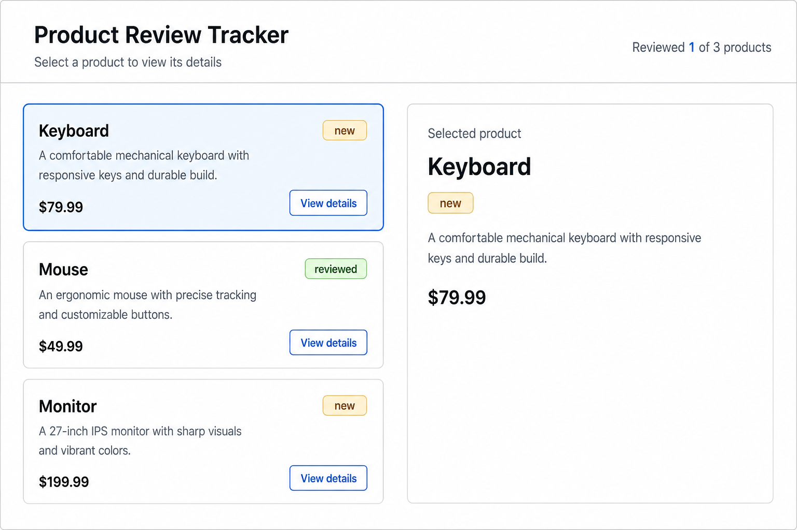

# 03 Events And useState

[Back to React Study Plan](../README.md)

## Goal

Learn local interactivity.

By the end of this lesson, clicking a product should update the selected product panel.

## Big Words

### Big Word Alert: Event Handler

An event handler is a function React runs after a user action, such as clicking a button.

In JSX, `onClick` should receive a function.

React needs a function it can call later, after the click. Calling the handler while
rendering gives `onClick` the function's return value instead.

```tsx
// Wrong: runs during render.
onClick={onSelect(product.id)}

// Correct: gives React a function to run after the click.
onClick={() => onSelect(product.id)}
```

### Big Word Alert: Closure

A closure is when a function remembers values from the scope where it was created.

In this lesson, each product click handler remembers which product was clicked.

For each rendered card, `() => onSelect(product.id)` closes over that card's
`product`. When React runs the function later, it can still read the correct ID. The
closure remembers the variable from that render; it does not remember the argument
because `onSelect` has not been called yet.

### Big Word Alert: useState

`useState` stores local component state.

Use it when one component needs to remember something that changes over time.

`useState` returns the current value and a setter. Calling the setter asks React to
render the component again with the new value; changing an ordinary variable would
not persist between renders or trigger the UI update.

Local state is enough while `App` and its descendants are the only components that
need the selection. Context becomes useful later when distant branches need shared
data and passing props through intermediate components becomes noisy.

### Big Word Alert: Details Component

A details component shows more information about one selected item.

In this lesson, `SelectedProductPanel` receives the selected product and renders its name, description, price, and review status.

### Conceptual Aside: State Changes Render Output

When state changes, React calls the component again.

The component returns new JSX based on the new state.

That is how clicking a product changes the selected product panel.

Store the smallest durable fact: the selected product's ID. The product object is
already in `products`, so `products.find(...)` can derive the corresponding object on
every render. Storing both the ID and object would create two sources of truth that
could disagree.

`App` performs that lookup because it owns both the products and selected ID.
`SelectedProductPanel` receives only the resulting product because rendering one
product is its entire job. Similarly, `App` calculates `isSelected` because comparing
the current ID is selection logic; `ProductCard` only needs the resulting boolean to
choose its style.

## App Step

Add product selection.

Clicking a product should update the selected product panel.

## What To Build

Add selected product behavior:

```text
click product card -> selectedProductId changes -> selected product panel updates
```

Still keep state local in `App.tsx`.

Do not use Context API yet.

Visible UI change:

```text
header subtitle: Select a product to view its details
left column: three product cards stacked vertically
right column: selected product details
selected card: blue border and pale-blue background
each card: View details button
```

There are no status-filter buttons in this lesson. The `All`, `New`, and `Reviewed` controls are introduced and coded in lesson 04.

Create or update these components:

```text
ProductCard
ProductStatusBadge
ReviewSummary
SelectedProductPanel
```

## Build Steps

1. Import `useState` in `App.tsx`.
2. Keep the `Product` type, products array, `ProductStatusBadge`, `ProductCard`, and `ReviewSummary` from lesson 02.
3. Change the header subtitle to `Select a product to view its details`.
4. Add `selectedProductId` state in `App`, initially set to `"keyboard"`.
5. Derive `selectedProduct` with `products.find(...)`.
6. Add `isSelected` and `onSelect` props to `ProductCard`.
7. Add the styled `View details` button inside `ProductCard`.
8. Call `onSelect(product.id)` from the button's `onClick` function.
9. Change the product area from the lesson 02 three-column card grid to a two-column workspace.
10. Stack the three `ProductCard` components in the workspace's left column.
11. Create `SelectedProductPanel` and render it in the workspace's right column.
12. Pass the derived `selectedProduct` into `SelectedProductPanel`.
13. Render the selected product's name, status, description, and price.
14. Confirm clicking each `View details` button updates the blue selected card and details panel.
15. Explain where closure happens in the click handler.

## Git Checkpoint

Before coding:

```powershell
git status
```

After coding:

```powershell
git status
git add .
git commit -m "feat(products): add product selection"
git push
```

## UI Target



Expected visible structure:

```text
[Product Review Tracker]                         [Reviewed 1 of 3 products]
[Select a product to view its details]

[Keyboard card selected]                        [Selected product]
[Mouse card]                                    [Keyboard details]
[Monitor card]
```

Component relationship:

```text
App
-> ReviewSummary
-> two-column workspace
   -> product-card stack
      -> ProductCard
         -> ProductStatusBadge
   -> SelectedProductPanel
      -> ProductStatusBadge
```

## Tailwind Classes To Reuse

```text
Layout: grid gap-4 md:grid-cols-[1fr_360px]
Selected Row: border-blue-500 bg-blue-50
Button: rounded-md border border-blue-600 px-4 py-2 font-medium text-blue-700 hover:bg-blue-50
Panel: rounded-lg border border-slate-200 bg-white p-4 shadow-sm
Panel Title: text-lg font-semibold text-slate-950
Panel Text: mt-2 text-sm leading-6 text-slate-600
```

## Suggested State Shape

```tsx
const [selectedProductId, setSelectedProductId] = useState("keyboard");

const selectedProduct = products.find(
  (product) => product.id === selectedProductId,
);
```

## Suggested Handler Shape

```tsx
function handleSelectProduct(productId: string) {
  setSelectedProductId(productId);
}
```

## Update App And Connect The Components

This is the missing parent connection. `App` owns the selected ID, derives the selected product, and passes data and callbacks into the child components:

```tsx
function App() {
  const [selectedProductId, setSelectedProductId] = useState("keyboard");

  const selectedProduct = products.find(
    (product) => product.id === selectedProductId,
  );

  function handleSelectProduct(productId: string) {
    setSelectedProductId(productId);
  }

  return (
    <main className="min-h-screen bg-slate-50 p-6 text-slate-950">
      <section className="mx-auto max-w-6xl rounded-xl border border-slate-200 bg-white p-6 shadow-sm">
        <header className="flex flex-col gap-4 border-b border-slate-200 pb-4 md:flex-row md:items-center md:justify-between">
          <div className="space-y-2">
            <h1 className="text-3xl font-bold tracking-normal">
              Product Review Tracker
            </h1>
            <p className="text-lg text-slate-600">
              Select a product to view its details
            </p>
          </div>

          <ReviewSummary products={products} />
        </header>

        <div className="mt-6 grid gap-4 md:grid-cols-[1fr_360px]">
          <div className="space-y-4">
            <ProductCard
              product={products[0]}
              isSelected={products[0].id === selectedProductId}
              onSelect={handleSelectProduct}
            />
            <ProductCard
              product={products[1]}
              isSelected={products[1].id === selectedProductId}
              onSelect={handleSelectProduct}
            />
            <ProductCard
              product={products[2]}
              isSelected={products[2].id === selectedProductId}
              onSelect={handleSelectProduct}
            />
          </div>

          <SelectedProductPanel product={selectedProduct} />
        </div>
      </section>
    </main>
  );
}
```

The layout changes because the new details panel needs its own column. On smaller screens, the grid becomes one column and the details panel appears below the product cards.

The repeated calls are intentional at this checkpoint. Lesson 04 introduces list
rendering with `.map` and explains why every rendered item then needs a `key`.

## Suggested Component Shapes

Pass only what each component needs.

`ProductCard` needs the product, whether it is selected, and what to do when the user selects it:

```tsx
type ProductCardProps = {
  product: Product;
  isSelected: boolean;
  onSelect: (productId: string) => void;
};

function ProductCard({ product, isSelected, onSelect }: ProductCardProps) {
  const cardClassName = isSelected
    ? "rounded-lg border border-blue-500 bg-blue-50 p-4 shadow-sm"
    : "rounded-lg border border-slate-200 bg-white p-4 shadow-sm";

  return (
    <article className={cardClassName}>
      <div className="flex items-start justify-between gap-3">
        <h2 className="text-xl font-semibold text-slate-950">
          {product.name}
        </h2>

        <ProductStatusBadge reviewStatus={product.reviewStatus} />
      </div>

      <p className="mt-2 text-sm leading-6 text-slate-600">
        {product.description}
      </p>

      <div className="mt-4 flex flex-wrap items-center justify-between gap-3">
        <p className="text-lg font-bold text-slate-950">
          ${product.price}
        </p>

        <button
          type="button"
          className="rounded-md border border-blue-600 px-4 py-2 font-medium text-blue-700 hover:bg-blue-50"
          onClick={() => onSelect(product.id)}
        >
          View details
        </button>
      </div>
    </article>
  );
}
```

`SelectedProductPanel` needs the selected product. If no product is selected, render a calm fallback:

```tsx
type SelectedProductPanelProps = {
  product: Product | undefined;
};

function SelectedProductPanel({ product }: SelectedProductPanelProps) {
  if (!product) {
    return (
      <aside className="rounded-lg border border-slate-200 bg-white p-4 shadow-sm">
        <p className="text-sm text-slate-600">
          Select a product to view details.
        </p>
      </aside>
    );
  }

  return (
    <aside className="rounded-lg border border-slate-200 bg-white p-4 shadow-sm">
      <p className="text-sm font-medium text-slate-500">Selected product</p>

      <div className="mt-3 flex items-start justify-between gap-3">
        <h2 className="text-lg font-semibold text-slate-950">
          {product.name}
        </h2>

        <ProductStatusBadge reviewStatus={product.reviewStatus} />
      </div>

      <p className="mt-2 text-sm leading-6 text-slate-600">
        {product.description}
      </p>

      <p className="mt-4 text-lg font-bold text-slate-950">
        ${product.price}
      </p>
    </aside>
  );
}
```

## Common Mistakes

- Writing `onClick={handleSelectProduct(product.id)}` and calling the function during render.
- Storing the whole selected product object when the ID is enough.
- Forgetting that state updates cause React to render again.
- Moving to Context API before props and local state are understood.
- Creating the selected product panel inline and forgetting to give it a clear component name.
- Passing the whole products array into `SelectedProductPanel` when it only needs one selected product.

## Stop When You Can Explain

- Why `onClick` receives a function.
- Where closure appears.
- When `useState` is enough.
- Why selected product can be derived from `selectedProductId`.
- Why `SelectedProductPanel` receives `selectedProduct` as a prop.
- Why `ProductCard` receives `isSelected` instead of calculating selected state by itself.
