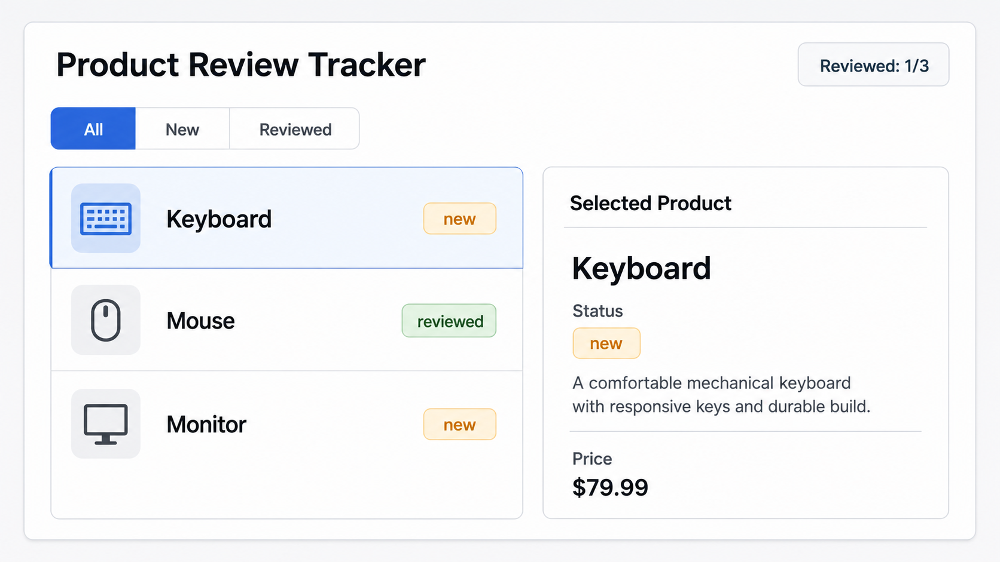

# 06 State Ownership And Props Chain

[Back to React Study Plan](../README.md)

## Goal

Understand where state should live before reaching for Context API.

By the end of this lesson, your app should still look the same, but product state should live in the top-level app component.

## Big Words

### Big Word Alert: State Ownership

State ownership means deciding which component is responsible for holding and changing a piece of state.

The owner should be the closest common parent of all components that need that state.

### Big Word Alert: Lifting State

Lifting state means moving state from a child component up to a parent component.

You do this when multiple components need to read or change the same state.

### Big Word Alert: Props Chain

A props chain is when state and callbacks are passed from parent to child to deeper child.

### Big Word Alert: Prop Drilling

Prop drilling is when props pass through components that do not personally need them, just to reach deeper components.

### Conceptual Aside: Feel The Pain Before Context

Do not jump to Context API too early.

First, pass props manually so you understand the problem Context will solve later.

## App Step

Move product state to the top-level app component.

Pass products, selected product, and actions down through props.

## What To Build

Keep the current UI.

Change the architecture:

```text
App owns products, selectedProductId, filter
-> App passes data and callbacks to children
-> children call callbacks instead of changing state directly
```

Visible UI change:

```text
none expected
selection, filters, summary, and details panel should still work
```

## Build Steps

1. Identify which component currently owns product state.
2. Move `products`, `selectedProductId`, and `filter` to `App`.
3. Create callback functions in `App`.
4. Pass products into product list component.
5. Pass selected product into details panel.
6. Pass callbacks into child components.
7. Confirm selecting and filtering still work.
8. Notice which props are becoming repetitive.

## Git Checkpoint

Before coding:

```powershell
git status
```

After coding:

```powershell
git status
git add .
git commit -m "refactor(state): lift product state to app component"
git push
```

## UI Target

Keep the same screen while changing where state lives:



Expected visible behavior:

```text
click product -> selected panel changes
click filter -> list changes
reviewed count still matches products
```

## Suggested Prop Flow

```text
App
-> ReviewSummary
-> FilterTabs
-> ProductList
   -> ProductRow
-> SelectedProductPanel
```

## Tailwind Classes To Preserve

Do not redesign in this lesson. Reuse the same classes from lessons 03 and 04:

```text
Layout: grid gap-4 md:grid-cols-[1fr_360px]
Filter Group: inline-flex overflow-hidden rounded-lg border border-slate-300
Selected Row: border-blue-500 bg-blue-50
Panel: rounded-lg border border-slate-200 bg-white p-4 shadow-sm
Counter: rounded-lg border border-slate-200 bg-slate-50 px-4 py-2 font-semibold
```

## Common Mistakes

- Letting two components own the same state.
- Duplicating selected product and selected product ID.
- Passing callbacks with unclear names like `handleClick`.
- Using Context before understanding which props are actually painful.

## Stop When You Can Explain

- Which component owns the product state.
- Why prop drilling becomes painful.
- Why Context API should solve a real problem, not appear too early.
- Which props you expect Context API to remove later.
