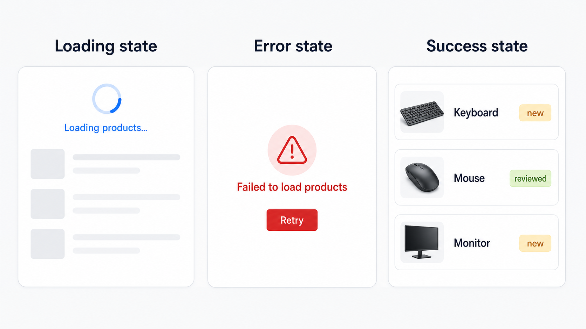

# 06 State Ownership And Props Chain

[Back to React Study Plan](../README.md)

## Goal

Make state ownership and data flow intentional before introducing Context API.

By the end of this lesson, the tracker should behave and look the same as lesson 05, but the component boundaries and prop contracts should clearly show how `App` owns state and shares it with descendants.

## Big Words

### Big Word Alert: State Ownership

State ownership means deciding which component stores and changes a piece of state. The owner should be the closest common parent of every component that needs to read or update it.

### Big Word Alert: Lifting State

Lifting state means moving state from a child to a common parent so sibling components can share one source of truth.

In this tracker, the state already lives in `App`, so do not move it again. Lesson 03 placed selection there, lesson 04 added the filter there, and lesson 05 added API state there. This lesson explains why that ownership is correct.

### Big Word Alert: Props Chain

A props chain is data and callbacks moving through more than one component level:

```text
App -> ProductWorkspace -> ProductList -> ProductRow
```

### Big Word Alert: Prop Drilling

Prop drilling occurs when an intermediate component receives props mainly so it can forward them to a deeper component.

### Big Word Alert: Callback Prop

A callback prop is a function passed from a parent to a child. The child reports an event upward by calling it; the parent that owns the state decides how state changes.

### Conceptual Aside: Data Flows Down And Events Flow Up

Parents pass current data down through props. Children report user actions upward through callback props. This one-way flow makes it possible to trace where a displayed value came from and where it can change.

## Keep The Cumulative Data Model

Do not remove fields introduced in lesson 05:

```ts
type ReviewStatus = "new" | "reviewed";
type ProductFilter = "all" | ReviewStatus;

type Product = {
  id: string;
  name: string;
  description: string;
  price: number;
  imageUrl: string;
  reviewStatus: ReviewStatus;
};
```

`App` continues to own:

```text
products
selectedProductId
filter
isLoading
error
requestVersion
```

These remain derived values, not state:

```text
visibleProducts
selectedProduct
reviewedCount
```

They are calculated from the current source state during rendering. Storing them separately would create two values that can disagree, such as a `selectedProductId` that changes while a copied `selectedProduct` object remains stale.

### Why App Owns This State

Choose the closest common parent of every reader and updater. In this tracker, the summary reads products, the filters read and change the filter, the list reads products and selection, and the details panel reads the selected product. `App` is their closest common parent, so one App-owned state keeps all sibling views synchronized.

Local UI state that only one child needs should stay in that child. Moving every value to `App` would make ownership less precise, not more reusable.

## What To Build

Extract a `ProductWorkspace` component between `App` and the UI components. This produces a real props chain that Context API will simplify in lesson 08.

```text
App owns state and runs the API Effect
-> ReviewSummary receives counts
-> ProductWorkspace receives tracker data and callbacks
   -> FilterTabs receives filter and onFilterChange
   -> ProductList receives products, selection, and onSelect
      -> ProductRow receives one product
   -> SelectedProductPanel receives the selected product
```

Visible UI change:

```text
none
```

The header, tabs, two-column layout, loading/error/empty states, product images, selection, and details panel must remain visually unchanged.

## Build Steps

1. Confirm every `useState` and the API Effect are in `App`.
2. Keep `visibleProducts`, `selectedProduct`, and `reviewedCount` derived in `App`.
3. Create clearly named handlers in `App`: `handleSelectProduct`, `handleFilterChange`, and `handleRetry`.
4. Create `ProductWorkspaceProps` with the exact values and callbacks the workspace forwards.
5. Move the filter tabs and two-column success layout into `ProductWorkspace`.
6. Pass `filter` and `onFilterChange` to `FilterTabs`.
7. Pass filtered products, selected ID, and `onSelect` to `ProductList`.
8. Pass the selected product to `SelectedProductPanel`.
9. Keep loading, error, and empty branches in `App`, because they depend on App-owned request state.
10. Verify every interaction still works before and after the refactor.
11. Identify the props that `ProductWorkspace` only forwards. Those are the prop-drilling pressure that lesson 08 will address.

## Name The App Handlers

```tsx
function handleSelectProduct(productId: string) {
  setSelectedProductId(productId);
}

function handleFilterChange(nextFilter: ProductFilter) {
  setFilter(nextFilter);
}

function handleRetry() {
  setRequestVersion((version) => version + 1);
}
```

Names such as `handleSelectProduct` explain the event. A generic name such as `handleClick` hides the intent.

Passing a named handler also protects the ownership boundary: children report what happened, while `App` decides whether that event changes state, dispatches an action, logs activity, or does several of those jobs later. Passing a raw setter exposes the storage mechanism instead of the feature's intent.

## Build ProductWorkspace

```tsx
type ProductWorkspaceProps = {
  visibleProducts: Product[];
  selectedProductId: string | null;
  selectedProduct: Product | undefined;
  filter: ProductFilter;
  onFilterChange: (filter: ProductFilter) => void;
  onSelectProduct: (productId: string) => void;
};

function ProductWorkspace({
  visibleProducts,
  selectedProductId,
  selectedProduct,
  filter,
  onFilterChange,
  onSelectProduct,
}: ProductWorkspaceProps) {
  return (
    <section aria-label="Product review workspace">
      <FilterTabs filter={filter} onFilterChange={onFilterChange} />

      <div className="mt-6 grid gap-4 md:grid-cols-[minmax(0,1fr)_360px]">
        <ProductList
          products={visibleProducts}
          selectedProductId={selectedProductId}
          onSelect={onSelectProduct}
        />

        <SelectedProductPanel product={selectedProduct} />
      </div>
    </section>
  );
}
```

Notice that `ProductWorkspace` does not select a product or change a filter itself. It lays out the feature and forwards events to the owner.

Trace a row click through the chain:

```text
App passes selectedProductId down
ProductRow calls onSelect(product.id)
ProductList and ProductWorkspace forward that event upward
App's handleSelectProduct updates the owned state
React renders descendants again with the new selectedProductId
```

Data such as `visibleProducts`, `filter`, and `selectedProductId` flows down. Event callbacks such as `onSelectProduct` and `onFilterChange` carry user intent up. The child does not directly edit the parent's state.

### Where Forwarding Becomes Prop Drilling

`ProductWorkspace` genuinely uses `visibleProducts` to configure the list and `selectedProduct` to configure the panel. However, it mostly forwards `selectedProductId`, `filter`, `onFilterChange`, `onSelectProduct`, and later `onMarkReviewed` to deeper components. Those repeatedly forwarded feature values create the prop-drilling pressure that Context will address in lesson 08.

Passing a prop through one or two levels is not automatically a problem. Keep explicit presentation props when they make a reusable component easier to understand; use Context for widely shared feature state and actions.

Update the nullable selection prop introduced by API loading:

```tsx
type ProductListProps = {
  products: Product[];
  selectedProductId: string | null;
  onSelect: (productId: string) => void;
};
```

## Connect App To The Props Chain

Keep the page styling in actual JSX:

```tsx
return (
  <main className="min-h-screen bg-slate-50 p-6 text-slate-950">
    <div className="mx-auto max-w-6xl rounded-xl border border-slate-200 bg-white p-6 shadow-sm">
      <header className="flex flex-col gap-4 border-b border-slate-200 pb-4 md:flex-row md:items-center md:justify-between">
        <div className="space-y-2">
          <h1 className="text-3xl font-bold text-slate-950">
            Product Review Tracker
          </h1>
          <p className="text-lg text-slate-600">Review products by status</p>
        </div>

        <ReviewSummary
          reviewedCount={reviewedCount}
          totalCount={products.length}
        />
      </header>

      <div className="mt-6">
        {isLoading ? <ProductListSkeleton /> : null}

        {!isLoading && error ? (
          <ProductLoadError message={error} onRetry={handleRetry} />
        ) : null}

        {!isLoading && !error && products.length === 0 ? (
          <p className="rounded-lg border border-dashed border-slate-300 bg-slate-50 p-6 text-center text-slate-600">
            No products found.
          </p>
        ) : null}

        {!isLoading && !error && products.length > 0 ? (
          <ProductWorkspace
            visibleProducts={visibleProducts}
            selectedProductId={selectedProductId}
            selectedProduct={selectedProduct}
            filter={filter}
            onFilterChange={handleFilterChange}
            onSelectProduct={handleSelectProduct}
          />
        ) : null}
      </div>
    </div>
  </main>
);
```

This is intentionally verbose. Lesson 08 will remove repeated feature props with Context, but loading state can still remain close to the component that owns the request.

## UI Target



This is an architecture-only refactor. Preserve the API thumbnails and all request states from lesson 05; do not return to the placeholder rows shown in lesson 04.

## Git Checkpoint

Before coding:

```powershell
git status
```

After the UI and behavior match lesson 05:

```powershell
git status
git add .
git commit -m "refactor(state): make product state ownership explicit"
git push
```

## Common Mistakes

- Moving state out of `App` even though multiple sibling areas need it.
- Duplicating the selected product object in state instead of deriving it from the ID.
- Giving `ProductWorkspace` its own copy of `filter` or `products` state.
- Passing `setState` everywhere without naming the event at the ownership boundary.
- Changing the UI while performing an architecture-only lesson.
- Using Context now instead of first observing which props are repetitive.

## Stop When You Can Explain

- Why `App` is the correct owner for this shared state.
- Why lifting state is defined here even though no further lift is needed.
- Which data flows down and which events flow up.
- Where the props chain becomes prop drilling.
- Which `ProductWorkspace` props Context API could remove later.
