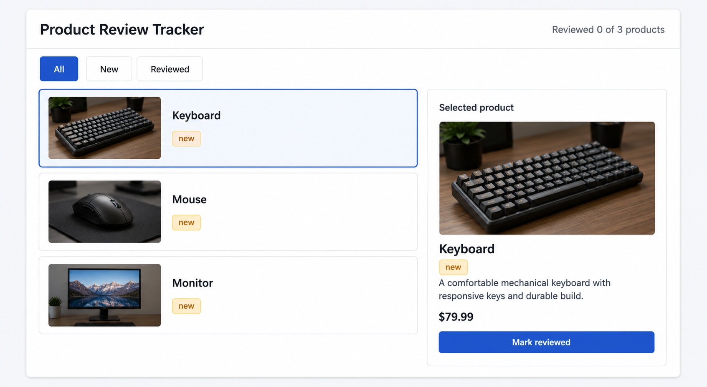

# 07 useReducer

[Back to React Study Plan](../README.md)

## Goal

Make related state transitions explicit and predictable.

By the end of this lesson, selection, filtering, API request state, retry, and marking a product reviewed should all go through one reducer.

## Big Words

### Big Word Alert: Reducer

A reducer is a pure function that receives the current state and an action, then returns the next complete state.

```text
current state + action -> reducer -> next state
```

### Big Word Alert: Action

An action is an object describing what happened. Its `type` names the event and any other properties carry the event data.

```ts
{ type: "productSelected", productId: "1" }
```

### Big Word Alert: Dispatch

`dispatch` sends an action to the reducer. It does not immediately mutate state.

### Big Word Alert: Pure Function

A pure function does not mutate its inputs or perform side effects. Given the same state and action, a reducer should return the same next state.

### Big Word Alert: Discriminated Union

A discriminated union is a union of object types that share one literal property. Here, `action.type` lets TypeScript narrow the action and reveal the correct payload inside each `case`.

### Big Word Alert: State Transition

A state transition is the movement from one valid application state to another after an event.

### Conceptual Aside: Reducers Decide State, Effects Perform Effects

The reducer synchronously calculates state and stays pure. The API Effect performs `fetch`, then dispatches success or failure actions. Keeping those jobs separate makes both easier to reason about and test.

## Keep The Cumulative Data Model

Continue using the lesson 05 product model:

```ts
type ReviewStatus = "new" | "reviewed";
type ProductFilter = "all" | ReviewStatus;

type Product = {
  id: string;
  name: string;
  description: string;
  price: number;
  imageUrl: string;
  reviewStatus: ReviewStatus;
};
```

Do not add `reviewNote` yet. The review form and its state belong to lesson 09.

## What To Build

Replace the related `useState` calls from lessons 04–06 with one `useReducer`:

```text
select row -> productSelected
click filter -> filterChanged
start request -> productsLoadStarted
request succeeds -> productsLoaded
request fails -> productsLoadFailed
click Retry -> productsReloadRequested
click Mark as reviewed -> productReviewed
```

Most of the UI remains unchanged. Add one deliberate control to `SelectedProductPanel`: a `Mark as reviewed` button for a product whose status is `new`. After clicking it:

- The badge changes to `reviewed`.
- The reviewed summary increases.
- The row moves between filtered lists when necessary.
- The button disappears for the reviewed product.

## Build Steps

1. Import `useReducer` and keep `useEffect`.
2. Create `ProductState` containing the related state from prior lessons.
3. Create a discriminated `ProductAction` union.
4. Create `initialProductState`.
5. Write `productReducer` without mutation or API calls.
6. Replace the related `useState` calls with `useReducer`.
7. Update the API Effect to dispatch started, loaded, and failed actions.
8. Make Retry dispatch `productsReloadRequested`.
9. Derive `visibleProducts`, `selectedProduct`, and `reviewedCount` from reducer state.
10. Replace selection and filter setters with dispatching handlers.
11. Add `onMarkReviewed` to `SelectedProductPanel`.
12. Render a styled `Mark as reviewed` button only for a new product.
13. Verify loading, failure, retry, filters, selection, count, and reviewed status.

## Define State And Actions

```ts
type ProductState = {
  products: Product[];
  selectedProductId: string | null;
  filter: ProductFilter;
  isLoading: boolean;
  error: string | null;
  requestVersion: number;
};

type ProductAction =
  | { type: "productSelected"; productId: string }
  | { type: "filterChanged"; filter: ProductFilter }
  | { type: "productReviewed"; productId: string }
  | { type: "productsLoadStarted" }
  | { type: "productsLoaded"; products: Product[] }
  | { type: "productsLoadFailed"; message: string }
  | { type: "productsReloadRequested" };

const initialProductState: ProductState = {
  products: [],
  selectedProductId: null,
  filter: "all",
  isLoading: true,
  error: null,
  requestVersion: 0,
};
```

`visibleProducts`, `selectedProduct`, and `reviewedCount` are still derived. They do not belong in `ProductState`.

Each reducer term has one job in the tracker:

```text
state    = the current product-review snapshot
action   = a typed description of what happened
dispatch = the function that sends an action
reducer  = the pure function that calculates the next snapshot
```

The action union prevents mismatched payloads. After TypeScript sees a specific `action.type`, it narrows `action` to that union member:

```ts
case "productSelected":
  // Here action.productId exists, but action.products and action.message do not.
  return { ...state, selectedProductId: action.productId };
```

## Build The Complete Reducer

```ts
function productReducer(
  state: ProductState,
  action: ProductAction,
): ProductState {
  switch (action.type) {
    case "productSelected":
      return { ...state, selectedProductId: action.productId };

    case "filterChanged":
      return { ...state, filter: action.filter };

    case "productReviewed":
      return {
        ...state,
        products: state.products.map((product) =>
          product.id === action.productId
            ? { ...product, reviewStatus: "reviewed" }
            : product,
        ),
      };

    case "productsLoadStarted":
      return { ...state, isLoading: true, error: null };

    case "productsLoaded": {
      const selectedProductStillExists = action.products.some(
        (product) => product.id === state.selectedProductId,
      );

      return {
        ...state,
        products: action.products,
        selectedProductId: selectedProductStillExists
          ? state.selectedProductId
          : action.products[0]?.id ?? null,
        isLoading: false,
        error: null,
      };
    }

    case "productsLoadFailed":
      return {
        ...state,
        products: [],
        selectedProductId: null,
        isLoading: false,
        error: action.message,
      };

    case "productsReloadRequested":
      return {
        ...state,
        isLoading: true,
        error: null,
        requestVersion: state.requestVersion + 1,
      };

    default:
      return state;
  }
}
```

The map in `productReviewed` creates a new array and a new object only for the matching product. It does not mutate `state.products`.

```ts
// Wrong: changes an object that belongs to the previous state.
state.products[0].reviewStatus = "reviewed";
return state;

// Correct: returns a new state, array, and changed product object.
return {
  ...state,
  products: state.products.map((product) =>
    product.id === action.productId
      ? { ...product, reviewStatus: "reviewed" }
      : product,
  ),
};
```

React uses object identity to recognize changed state. Returning the same mutated objects can hide a change from React and also corrupt the previous state snapshot, which makes behavior and tests harder to reason about.

The `{ ...state, changedField: value }` pattern copies every unchanged field into the next state before replacing the named field. Returning only `{ products: action.products }` would drop selection, filter, loading, error, and request version from the complete state object.

## Use The Reducer In App

```tsx
const [state, dispatch] = useReducer(productReducer, initialProductState);

const visibleProducts =
  state.filter === "all"
    ? state.products
    : state.products.filter(
        (product) => product.reviewStatus === state.filter,
      );

const selectedProduct = state.products.find(
  (product) => product.id === state.selectedProductId,
);

const reviewedCount = state.products.filter(
  (product) => product.reviewStatus === "reviewed",
).length;
```

These values are derived because the reducer already stores everything needed to calculate them. Duplicating `reviewedCount` in state would require every product-changing action to update both products and the count perfectly.

Create event handlers that translate UI events into actions:

```tsx
function handleSelectProduct(productId: string) {
  dispatch({ type: "productSelected", productId });
}

function handleFilterChange(filter: ProductFilter) {
  dispatch({ type: "filterChanged", filter });
}

function handleMarkReviewed(productId: string) {
  dispatch({ type: "productReviewed", productId });
}

function handleRetry() {
  dispatch({ type: "productsReloadRequested" });
}
```

## Update The API Effect

Keep `fetch` outside the reducer. Reuse `ApiProduct` and `ProductsResponse` from lesson 05:

```tsx
useEffect(() => {
  const controller = new AbortController();

  async function loadProducts() {
    dispatch({ type: "productsLoadStarted" });

    try {
      const response = await fetch(
        "https://dummyjson.com/products?limit=3",
        { signal: controller.signal },
      );

      if (!response.ok) {
        throw new Error(`Request failed with status ${response.status}`);
      }

      const data: ProductsResponse = await response.json();
      const products: Product[] = data.products.map((apiProduct) => ({
        id: String(apiProduct.id),
        name: apiProduct.title,
        description: apiProduct.description,
        price: apiProduct.price,
        imageUrl: apiProduct.thumbnail,
        reviewStatus: "new",
      }));

      dispatch({ type: "productsLoaded", products });
    } catch (caughtError) {
      if (caughtError instanceof DOMException && caughtError.name === "AbortError") {
        return;
      }

      dispatch({
        type: "productsLoadFailed",
        message:
          caughtError instanceof Error
            ? caughtError.message
            : "Unable to load products.",
      });
    }
  }

  void loadProducts();

  return () => controller.abort();
}, [state.requestVersion]);
```

The Effect performs the side effect. Its actions report what happened; the reducer decides the next state.

Calling `fetch` inside the reducer would make the same state and action produce different results depending on the network. It could also start another request whenever React evaluates the reducer. Keeping the request in the Effect lets the reducer remain synchronous and deterministic.

The request actions describe a small state machine:

```text
productsLoadStarted -> loading, no previous error
productsLoaded -> products available, loading finished
productsLoadFailed -> readable error, loading finished
productsReloadRequested -> loading and a new requestVersion
```

## Connect Reducer State To The Existing UI

Replace the old state variable references in the header and request branches. Keep all Tailwind classes from lessons 05 and 06:

```tsx
<ReviewSummary
  reviewedCount={reviewedCount}
  totalCount={state.products.length}
/>

<div className="mt-6">
  {state.isLoading ? <ProductListSkeleton /> : null}

  {!state.isLoading && state.error ? (
    <ProductLoadError message={state.error} onRetry={handleRetry} />
  ) : null}

  {!state.isLoading && !state.error && state.products.length === 0 ? (
    <p className="rounded-lg border border-dashed border-slate-300 bg-slate-50 p-6 text-center text-slate-600">
      No products found.
    </p>
  ) : null}

  {!state.isLoading && !state.error && state.products.length > 0 ? (
    <ProductWorkspace
      visibleProducts={visibleProducts}
      selectedProductId={state.selectedProductId}
      selectedProduct={selectedProduct}
      filter={state.filter}
      onFilterChange={handleFilterChange}
      onSelectProduct={handleSelectProduct}
      onMarkReviewed={handleMarkReviewed}
    />
  ) : null}
</div>
```

There should be no remaining `setProducts`, `setFilter`, `setSelectedProductId`, `setIsLoading`, or `setError` calls after this refactor.

## Add The Review Action To The UI

Extend the selected panel contract:

```tsx
type SelectedProductPanelProps = {
  product: Product | undefined;
  onMarkReviewed: (productId: string) => void;
};
```

Keep the existing styled panel content and add this after the price:

```tsx
{product.reviewStatus === "new" ? (
  <button
    type="button"
    className="mt-6 w-full rounded-md bg-emerald-600 px-4 py-2 font-medium text-white hover:bg-emerald-700"
    onClick={() => onMarkReviewed(product.id)}
  >
    Mark as reviewed
  </button>
) : (
  <p className="mt-6 rounded-md border border-emerald-200 bg-emerald-50 p-3 text-center font-medium text-emerald-700">
    Review complete
  </p>
)}
```

Pass the action through the existing workspace. Update its full prop contract so every name matches lesson 06:

```tsx
type ProductWorkspaceProps = {
  visibleProducts: Product[];
  selectedProductId: string | null;
  selectedProduct: Product | undefined;
  filter: ProductFilter;
  onFilterChange: (filter: ProductFilter) => void;
  onSelectProduct: (productId: string) => void;
  onMarkReviewed: (productId: string) => void;
};
```

Inside `ProductWorkspace`, destructure `onMarkReviewed` and forward it to the panel:

```tsx
<SelectedProductPanel
  product={selectedProduct}
  onMarkReviewed={onMarkReviewed}
/>
```

Then pass the App handler into the workspace:

```tsx
<ProductWorkspace
  visibleProducts={visibleProducts}
  selectedProductId={state.selectedProductId}
  selectedProduct={selectedProduct}
  filter={state.filter}
  onFilterChange={handleFilterChange}
  onSelectProduct={handleSelectProduct}
  onMarkReviewed={handleMarkReviewed}
/>
```

This is one more prop in the chain and another clear reason to learn Context next.

`useReducer` is useful here because selection, filters, API status, Retry, and review changes are related transitions over one state shape. For a single independent boolean or input, `useState` would remain simpler; a reducer earns its place when named events make several coordinated updates easier to follow.

Keep the existing Tailwind classes for the header, summary, filters, rows, request states, images, and two-column layout. The only new styling is the review button and completed message shown above.

## UI Target



This target contains exactly the new visible Lesson 07 control: `Mark reviewed` at the bottom of the selected-product panel. It does not contain review notes or search because those arrive in lessons 09 and 10.

## Git Checkpoint

Before coding:

```powershell
git status
```

After every action and API state works:

```powershell
git status
git add .
git commit -m "refactor(state): manage product state with reducer"
git push
```

## Common Mistakes

- Mutating a product object or `state.products` inside the reducer.
- Calling `fetch` inside the reducer.
- Leaving some related setters active while also storing the same values in reducer state.
- Putting derived values such as `reviewedCount` into reducer state.
- Returning only `{ products: action.products }` and accidentally deleting the rest of the state.
- Adding `reviewNoteChanged` before the review form exists.
- Dispatching `productsReloadRequested` without using `state.requestVersion` in the Effect dependency array.

## Stop When You Can Explain

- What state, action, reducer, and dispatch each do.
- How the discriminated union narrows each action payload.
- Why the reducer is pure while the Effect performs `fetch`.
- How `productReviewed` updates data without mutation.
- Why derived values stay outside reducer state.
- Why `useReducer` is useful now that several related transitions exist.
