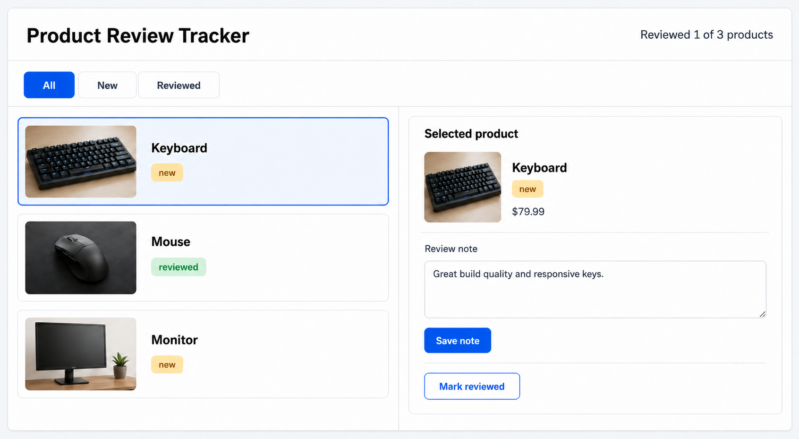

# 09 Forms And Validation

[Back to React Study Plan](../README.md)

## Goal

Add a controlled review-note form to the selected-product panel.

By the end of this lesson, a user can type, validate, and save one note on the selected product. This is the only lesson from 08-11 that intentionally changes the visible UI.

## Data Model Change

Add one optional field to the existing `Product` type:

```ts
export type Product = {
  id: string;
  name: string;
  description: string;
  price: number;
  imageUrl: string;
  reviewStatus: "new" | "reviewed";
  reviewNote?: string;
};
```

Do not replace or rename existing fields. API products can begin without a note because `reviewNote` is optional.

## Big Words

### Big Word Alert: Controlled Input

A controlled input receives its displayed `value` from React state and reports edits through `onChange`. React state is the source of truth for what appears in the field.

### Big Word Alert: Form Submission

Form submission is the event produced by clicking a submit button or pressing Enter in a form. Handle the form's `onSubmit`, not only a button click.

### Big Word Alert: Validation

Validation checks that input follows the app's rules before data is saved. Here, a note containing only whitespace is invalid.

### Big Word Alert: Source Of Truth

The source of truth is the authoritative location for a value. `noteDraft` owns the text being edited; `product.reviewNote` owns the last saved note.

### Conceptual Aside: Draft State And Saved State Have Different Lifetimes

Typing should not modify the product on every keystroke. A local draft lets the user edit and validate freely; dispatching `reviewNoteChanged` deliberately copies accepted text into shared product state.

## What To Build

```text
Review note
[textarea                                ]
[Save note]
```

Visible states:

```text
empty submit -> Review note is required.
valid submit -> Saved note appears below the form
change selected product -> that product's saved note or an empty draft appears
```

The header, filters, list, selection styling, and details layout remain unchanged.

## Files To Update

```text
src/types/product.ts
src/state/productReducer.ts
src/components/SelectedProductPanel.tsx
src/components/ReviewNoteForm.tsx
```

## Build Steps

1. Add optional `reviewNote` to `Product`.
2. Add a new `reviewNoteChanged` action with `productId` and `reviewNote`.
3. Handle that action immutably in `productReducer`.
4. Create `ReviewNoteForm`.
5. Pass the selected product's `id` and `reviewNote` into the form.
6. Keep `noteDraft` and `errorMessage` local to the form.
7. Bind the textarea's `value` and `onChange`.
8. Handle the form's `onSubmit` and call `event.preventDefault()`.
9. Reject `noteDraft.trim()` when it is empty.
10. Dispatch the trimmed note when valid.
11. Clear the error after valid typing or a successful save.
12. Show the saved note from `product.reviewNote`, not from the draft.
13. Switch products and confirm each product displays its own note.

## Add The Reducer Action

Add this member to the existing `ProductAction` union:

```ts
| {
    type: "reviewNoteChanged";
    productId: string;
    reviewNote: string;
  }
```

Add this reducer case:

```ts
case "reviewNoteChanged":
  return {
    ...state,
    products: state.products.map((product) =>
      product.id === action.productId
        ? { ...product, reviewNote: action.reviewNote }
        : product,
    ),
  };
```

This preserves every unedited product object and creates a new object only for the matching product.

## Build The Controlled Form

```tsx
import { useState, type FormEvent } from "react";
import { useProductReview } from "../context/ProductReviewContext";

type ReviewNoteFormProps = {
  productId: string;
  savedNote?: string;
};

export function ReviewNoteForm({
  productId,
  savedNote,
}: ReviewNoteFormProps) {
  const { dispatch } = useProductReview();
  const [noteDraft, setNoteDraft] = useState(savedNote ?? "");
  const [errorMessage, setErrorMessage] = useState<string | null>(null);

  function handleSubmit(event: FormEvent<HTMLFormElement>) {
    event.preventDefault();
    const trimmedNote = noteDraft.trim();

    if (!trimmedNote) {
      setErrorMessage("Review note is required.");
      return;
    }

    dispatch({
      type: "reviewNoteChanged",
      productId,
      reviewNote: trimmedNote,
    });
    setNoteDraft(trimmedNote);
    setErrorMessage(null);
  }

  return (
    <form
      className="mt-4 space-y-3 border-t border-slate-200 pt-4"
      onSubmit={handleSubmit}
      noValidate
    >
      <div>
        <label
          className="block text-sm font-medium text-slate-700"
          htmlFor={`review-note-${productId}`}
        >
          Review note
        </label>

        <textarea
          id={`review-note-${productId}`}
          className="mt-2 min-h-28 w-full rounded-md border border-slate-300 px-3 py-2 text-slate-950 outline-none focus:border-blue-500"
          value={noteDraft}
          onChange={(event) => {
            setNoteDraft(event.target.value);
            if (errorMessage) setErrorMessage(null);
          }}
          aria-invalid={errorMessage !== null}
          aria-describedby={
            errorMessage ? `review-note-error-${productId}` : undefined
          }
          placeholder="Write what you learned about this product"
        />

        {errorMessage && (
          <p
            id={`review-note-error-${productId}`}
            className="mt-2 text-sm font-medium text-red-700"
            role="alert"
          >
            {errorMessage}
          </p>
        )}
      </div>

      <div className="flex justify-end">
        <button
          type="submit"
          className="rounded-md bg-blue-600 px-4 py-2 font-medium text-white hover:bg-blue-700 focus:outline-none focus:ring-2 focus:ring-blue-500 focus:ring-offset-2"
        >
          Save note
        </button>
      </div>

      {savedNote && (
        <div className="rounded-md border border-slate-200 bg-slate-50 p-3 text-sm text-slate-700">
          <span className="font-semibold text-slate-950">Saved note:</span>{" "}
          {savedNote}
        </div>
      )}
    </form>
  );
}
```

## Reset Local State When Selection Changes

`useState(savedNote)` does not reset merely because a different product prop arrives. Give the form a product-based `key` so React creates fresh local draft state:

```tsx
<ReviewNoteForm
  key={selectedProduct.id}
  productId={selectedProduct.id}
  savedNote={selectedProduct.reviewNote}
/>
```

The `key` controls form identity so a keyboard draft does not appear when the mouse is selected.

## Update The Selected Product Panel

Keep the existing panel and add the form after its product information:

```tsx
<aside className="rounded-lg border border-slate-200 bg-white p-4 shadow-sm">
  <p className="text-sm font-medium text-slate-500">Selected product</p>

  <div className="mt-3 flex items-start justify-between gap-3">
    <h2 className="text-lg font-semibold text-slate-950">
      {selectedProduct.name}
    </h2>
    <ProductStatusBadge reviewStatus={selectedProduct.reviewStatus} />
  </div>

  
  <p className="mt-3 text-sm leading-6 text-slate-600">
    {selectedProduct.description}
  </p>
  <p className="mt-4 text-lg font-bold text-slate-950">
    ${selectedProduct.price.toFixed(2)}
  </p>

  <ReviewNoteForm
    key={selectedProduct.id}
    productId={selectedProduct.id}
    savedNote={selectedProduct.reviewNote}
  />
</aside>
```

## UI Target



```text
Initial: empty textarea and no error
Invalid: red "Review note is required." message
Saved: note appears in the quiet gray saved-note box
```

The selected panel remains `360px` wide on desktop through the parent layout and stacks below the list on smaller screens.

## Git Checkpoint

Before coding:

```powershell
git status
```

After coding:

```powershell
git status
git add .
git commit -m "feat(forms): add validated product review notes"
git push
```

## Common Mistakes

- Typing props as `Product["reviewNote"]` instead of an object with named props.
- Updating `product.reviewNote` on every keystroke.
- Saving whitespace because the value was not trimmed.
- Showing the draft as though it were already saved.
- Reusing one product's draft after selection changes.
- Forgetting `htmlFor`, `id`, and an accessible error relationship.

## Stop When You Can Explain

- Why the textarea is controlled.
- Why draft state stays local while saved notes live in reducer state.
- Why the form handles `onSubmit`.
- Why `key={selectedProduct.id}` resets the form when selection changes.
- Why the reducer uses `.map` instead of mutating the product.
