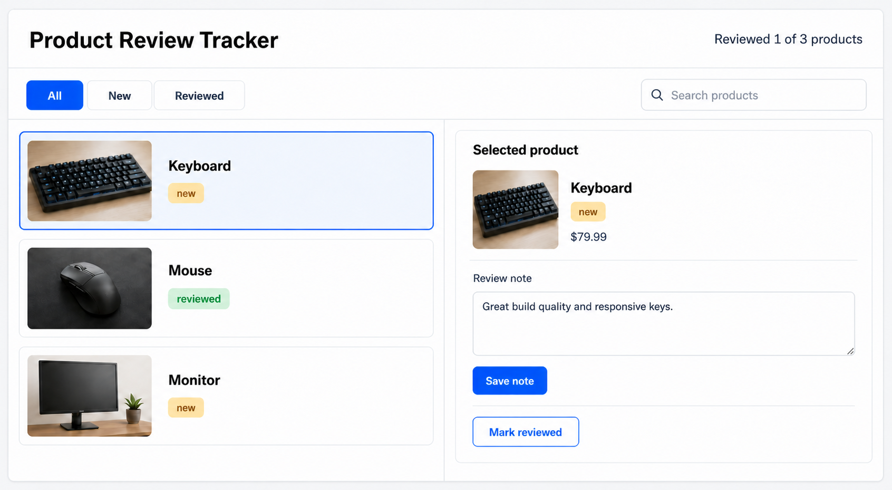

# 10 useMemo, useCallback, And memo

[Back to React Study Plan](../README.md)

## Goal

Apply memoization to one real component boundary and understand why each tool is needed.

By the end of this lesson, the user can search products by name, filtering produces a memoized value, row callbacks keep stable references, and memoized product rows can skip work when their props have not changed.

## Big Words

### Big Word Alert: Memoization

Memoization means reusing a previous result or reference when its inputs have not changed.

### Big Word Alert: `useMemo`

`useMemo` caches a calculated value between renders. Here, that value is the filtered products array.

### Big Word Alert: `useCallback`

`useCallback` caches a function reference between renders. It does not prevent the function from running when an event calls it.

### Big Word Alert: `memo`

`memo` lets React skip re-rendering a component when its props are equal to their previous values.

### Big Word Alert: Referential Equality

Objects, arrays, and functions are compared by reference. Two separately created functions can contain identical code but still be different values in memory.

### Big Word Alert: Normalization

Normalization means converting values into a consistent form before comparing them. Lowercasing and trimming the search query lets `Keyboard`, `keyboard`, and ` keyboard ` match the same product.

### Conceptual Aside: The Three Tools Form One Boundary

`memo(ProductRow)` can only help when the row receives stable props. `useMemo` stabilizes a calculated value, while `useCallback` stabilizes function props; together they make the component boundary meaningful.

Memoization is an optimization, not a correctness requirement. The UI must work before and after these changes.

## What To Build

```text
ProductWorkspace reads context
-> local searchQuery controls the search input
-> useMemo derives visibleProducts from products, filter, and searchQuery
-> useCallback creates stable row actions
-> memo(ProductRow) compares product, selected state, and callbacks
```

Visible UI change:

```text
[Search products input above the product rows]
```

Keep the review-note form, saved note, filters, selected-product panel, and Tailwind styling from lesson 09.

## Build Steps

1. Confirm the list works without memoization.
2. Keep `ProductWorkspace` as the context consumer and `ProductRow` as a presentation component.
3. Move the existing filter toolbar and two-column grid from `App` into `ProductWorkspace`; `App` should render one `<ProductWorkspace />` below the header.
4. Add local `searchQuery` state and a controlled search input beside `FilterTabs`.
5. Wrap the `visibleProducts` calculation in `useMemo`.
6. Filter by both review status and normalized product name.
7. Depend on `products`, `filter`, and `searchQuery` because all three affect the result.
8. Create `handleSelectProduct` with `useCallback`.
9. Create `handleMarkReviewed` with `useCallback`.
10. Depend on `dispatch`; React keeps reducer dispatch stable.
11. Keep `ProductRow` as a presentation component receiving one `product`, `isSelected`, and callbacks.
12. Export `memo(ProductRowComponent)`.
13. Temporarily add a console log inside `ProductRowComponent` to observe renders.
14. Search, change selection, and save a note; confirm the correct UI still updates.
15. Remove the temporary log before committing.

## Memoize List Values And Actions

```tsx
import { useCallback, useMemo, useState } from "react";
import { useProductReview } from "../context/ProductReviewContext";
import { FilterTabs } from "./FilterTabs";
import { ProductRow } from "./ProductRow";
import { SelectedProductPanel } from "./SelectedProductPanel";

export function ProductWorkspace() {
  const {
    state: { products, filter, selectedProductId },
    dispatch,
  } = useProductReview();

  const [searchQuery, setSearchQuery] = useState("");

  const visibleProducts = useMemo(() => {
    const normalizedQuery = searchQuery.trim().toLowerCase();

    return products.filter((product) => {
      const matchesStatus =
        filter === "all" || product.reviewStatus === filter;
      const matchesSearch = product.name
        .toLowerCase()
        .includes(normalizedQuery);

      return matchesStatus && matchesSearch;
    });
  }, [products, filter, searchQuery]);

  const handleSelectProduct = useCallback(
    (productId: string) => {
      dispatch({ type: "selected", productId });
    },
    [dispatch],
  );

  const handleMarkReviewed = useCallback(
    (productId: string) => {
      dispatch({ type: "reviewed", productId });
    },
    [dispatch],
  );

  const productContent =
    visibleProducts.length === 0 ? (
      <div className="rounded-lg border border-dashed border-slate-300 bg-slate-50 p-6 text-center text-slate-600">
        No products match your search and filter.
      </div>
    ) : (
      <div className="space-y-3">
        {visibleProducts.map((product) => (
          <ProductRow
            key={product.id}
            product={product}
            isSelected={product.id === selectedProductId}
            onSelect={handleSelectProduct}
            onMarkReviewed={handleMarkReviewed}
          />
        ))}
      </div>
    );

  return (
    <section className="mt-6">
      <div className="flex flex-col gap-4 md:flex-row md:items-center md:justify-between">
        <FilterTabs />

        <label className="block w-full md:max-w-sm">
          <span className="sr-only">Search products</span>
          <input
            type="search"
            className="w-full rounded-md border border-slate-300 bg-white px-3 py-2 text-slate-950 outline-none focus:border-blue-500"
            placeholder="Search products"
            value={searchQuery}
            onChange={(event) => setSearchQuery(event.target.value)}
          />
        </label>
      </div>

      <div className="mt-6 grid gap-4 md:grid-cols-[1fr_360px]">
        {productContent}
        <SelectedProductPanel />
      </div>
    </section>
  );
}
```

## Memoize The Row Boundary

Use the same `Product` type and `reviewStatus` property used throughout the app:

```tsx
import { memo } from "react";
import type { Product } from "../types/product";
import { ProductStatusBadge } from "./ProductStatusBadge";

type ProductRowProps = {
  product: Product;
  isSelected: boolean;
  onSelect: (productId: string) => void;
  onMarkReviewed: (productId: string) => void;
};

function ProductRowComponent({
  product,
  isSelected,
  onSelect,
  onMarkReviewed,
}: ProductRowProps) {
  const rowClassName = isSelected
    ? "rounded-lg border border-blue-500 bg-blue-50 p-4 shadow-sm"
    : "rounded-lg border border-slate-200 bg-white p-4 shadow-sm";

  return (
    <article className={rowClassName}>
      <div className="flex flex-col gap-4 sm:flex-row sm:items-center">
        

        <div className="min-w-0 flex-1">
          <div className="flex items-start justify-between gap-3">
            <h2 className="text-lg font-semibold text-slate-950">
              {product.name}
            </h2>
            <ProductStatusBadge reviewStatus={product.reviewStatus} />
          </div>
          <p className="mt-2 text-sm leading-6 text-slate-600">
            {product.description}
          </p>
          <p className="mt-2 font-bold text-slate-950">
            ${product.price.toFixed(2)}
          </p>
        </div>
      </div>

      <div className="mt-4 flex flex-wrap justify-end gap-2">
        <button
          type="button"
          className="rounded-md border border-slate-300 px-4 py-2 font-medium text-slate-700 hover:bg-slate-50"
          onClick={() => onSelect(product.id)}
        >
          View details
        </button>

        {product.reviewStatus === "new" && (
          <button
            type="button"
            className="rounded-md bg-blue-600 px-4 py-2 font-medium text-white hover:bg-blue-700"
            onClick={() => onMarkReviewed(product.id)}
          >
            Mark reviewed
          </button>
        )}
      </div>
    </article>
  );
}

export const ProductRow = memo(ProductRowComponent);
```

The inline arrow functions create small functions inside each row. That is fine: they stay inside the memoized component. The parent callbacks passed as props remain stable.

## Why Each Tool Is Here

| Tool | Protects | Dependency or comparison |
| --- | --- | --- |
| `useMemo` | `visibleProducts` value | Recalculate when `products`, `filter`, or `searchQuery` changes |
| `useCallback` | Parent callback references | Recreate when `dispatch` changes |
| `memo` | `ProductRow` render | Render when `product`, `isSelected`, or a callback changes |

When a product is updated immutably, only that product receives a new object reference. Unchanged rows keep their old product references and can benefit from `memo`.

## UI Target



```text
[Header and reviewed summary]
[All] [New] [Reviewed]                 [Search products]
[Product rows]                 [Selected product and review note]
```

- Selected rows still use `border-blue-500 bg-blue-50`.
- The search input uses `w-full rounded-md border border-slate-300 bg-white px-3 py-2` and remains readable at narrow widths.
- Row images stay `h-24` and do not resize the layout.
- Buttons wrap on narrow screens instead of overflowing.
- Saving a note updates the selected panel even though rows are memoized.

## Git Checkpoint

Before coding:

```powershell
git status
```

After coding:

```powershell
git status
git add .
git commit -m "perf(products): memoize the product row boundary"
git push
```

## Common Mistakes

- Using `useMemo` to perform side effects.
- Forgetting `searchQuery`, `filter`, or `products` in the dependency array.
- Passing a fresh object such as `options={{ selected: true }}` into a memoized row.
- Mutating a product object, which breaks reliable reference comparisons.
- Assuming `useCallback` prevents the callback from running.
- Memoizing every component without identifying a useful boundary.

## Stop When You Can Explain

- Why `useMemo` returns a value and `useCallback` returns a function.
- Why stable callbacks matter to `memo(ProductRow)`.
- Why immutable product updates help memoized rows.
- Why search is derived from the original products instead of stored as another products array.
- When removing memoization would make the code clearer.
