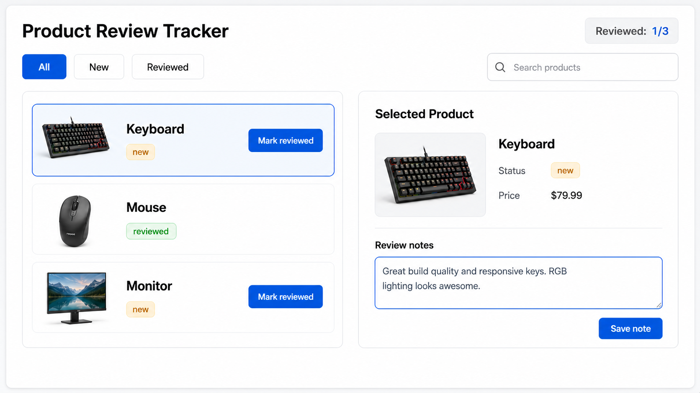

# Product Review Tracker Roadmap

[Back to React Study Plan](../README.md)

This is the one app we build during the React study.

## App Idea

A small dashboard for reviewing products.

The app starts in one file, then gets refactored as the lessons introduce better structure.

## Final UI Target



## One-File First

Start with one file so the behavior is easy to see:

```text
ProductReviewTracker.tsx
```

In the first version, keep together:

- hard-coded products
- selected product state
- filter state
- derived reviewed count
- event handlers
- JSX

## Git Checkpoint

Use the Git checkpoint inside each lesson. Commit only after the lesson's app phase works.

## Refactor Later

After the one-file version works, refactor gradually:

```text
components/
  ProductList.tsx
  ProductRow.tsx
  FilterTabs.tsx
  SelectedProductPanel.tsx
  ReviewSummary.tsx

context/
  ProductReviewContext.tsx

hooks/
  useProductReview.ts
  useProducts.ts

api/
  productApi.ts
```

## API Plan

Use DummyJSON:

```text
GET https://dummyjson.com/products?limit=5
```

Map each API product into the app's product shape and add local review fields.

## Final App Features

- Product list.
- Product selection.
- Status filters.
- Reviewed count.
- Review notes.
- API loading.
- Loading, error, and empty states.
- Mark reviewed action.
- Optimistic update and rollback.
- Context API state access.
- Behavior test.
